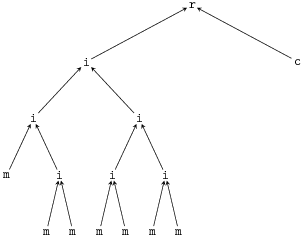

# Trees

Tree structure templates (i.e. trees without LUTs) are specified with a string containing the characters `r` for root, `m` for message,  `c` for channel LLR and `i` for intermediate.
We use pre-order depth-first serialization and `/` is used to indicate that the node has no more children, e.g.,
`riim/im/m///iim/m//im/m////c//` corresponds to



For an example on how to setup a decoder using such strings, cf. [tree_file_example.ini](tree_file_example.ini).

# Writing LUT trees
LUT trees can be easily exported  using the `<<` operator. E.g., the following simple program
```cpp
#include <itpp/itbase.h>
#include "LUT_Tree.hpp"

using namespace lut_ldpc;
using namespace itpp;
using namespace std;

int main(int argc, char **argv){

// Create the tree from the above example
LUT_Tree t8("riim/im/m///iim/m//im/m////c//", LUT_Tree::VARTREE);

// Setup input pmfs for tree DE update
double m1 = 3;
double m2 = 2;
int Nq_cha = 16;
int Nq_in = 16;
int Nq_out = 16;
vec p_msg =  get_gaussian_pmf(m1, std::sqrt(2*m1), Nq_in, std::sqrt(2*m1)/20);
vec p_cha =  get_gaussian_pmf(m2, std::sqrt(2*m2), Nq_in, std::sqrt(2*m2)/20);


t8.set_resolution( Nq_in, Nq_out, Nq_cha);
t8.set_leaves(p_msg,p_cha);

// Design LUTs
t8.update();

// Output LUTs
std::cout << t8;
}
```
produces the output
```
0 8
2
1 128 16
0 0 1 2 3 3 4 5 5 6 7 8 9 11 13 15 0 1 2 3 4 5 6 7 7 7 9 10 11 12 14 15 0 1 2 3 4 5 6 7 7 8 9 10 11 12 14 15 0 1 2 3 4 5 6 7 7 8 9 10 11 12 14 15 0 1 2 3 4 5 6 7 7 8 9 10 11 12 14 15 0 1 2 3 4 5 7 7 7 8 9 10 11 12 14 15 0 1 2 4 4 5 7 7 7 8 9 10 11 13 14 15 0 1 2 4 4 5 7 7 8 8 9 11 11 13 14 15
2
0 128 16
0 0 0 0 0 0 0 0 0 0 1 1 1 2 2 4 0 0 0 0 0 0 1 1 1 1 2 2 2 4 5 8 0 0 0 1 1 1 2 2 2 2 3 4 5 6 9 11 0 1 1 1 2 2 3 3 3 4 5 6 8 10 11 13 0 1 1 2 2 2 3 4 4 5 6 7 9 10 11 13 0 1 1 2 2 3 4 4 5 5 7 9 10 11 12 13 1 1 2 3 3 4 5 6 6 7 9 10 11 12 13 14 1 2 2 3 4 5 6 7 8 9 10 11 12 13 13 14
2
0 128 16
0 1 1 1 1 1 1 1 1 2 2 2 2 2 2 4 1 2 3 3 3 3 3 3 3 3 4 4 4 4 4 6 1 3 3 3 3 3 4 4 4 4 4 4 5 5 5 7 2 3 3 4 4 4 4 4 4 5 5 5 5 5 5 8 2 4 4 4 4 4 5 5 5 5 5 5 5 5 6 9 3 5 5 5 5 5 5 6 6 6 6 6 6 7 7 10 3 5 6 6 6 6 6 6 6 7 7 7 8 8 8 10 4 6 6 6 6 7 7 7 8 8 8 8 9 9 9 11
0
2 0 16
2
0 128 16
0 1 1 1 1 2 2 2 2 3 3 3 4 4 4 7 1 4 5 5 5 5 5 5 6 6 6 6 7 7 7 11 1 5 5 5 5 5 5 6 6 6 6 7 7 7 8 11 1 5 5 5 5 5 6 6 6 6 7 7 7 8 8 11 1 5 5 5 5 6 6 6 6 7 7 7 8 8 9 12 2 5 5 5 6 6 6 6 7 7 7 8 8 9 9 12 2 5 5 6 6 6 6 7 7 7 8 8 9 9 9 12 2 5 6 6 6 6 7 7 7 8 8 9 9 9 9 13
0
2 0 16
0
2 0 16
2
0 128 16
0 1 1 1 1 1 2 2 2 2 2 3 4 4 5 7 1 1 2 2 2 2 3 3 3 4 5 6 6 6 7 10 1 2 2 2 2 3 3 4 4 5 5 6 6 7 9 11 1 2 2 2 2 3 4 5 5 5 6 7 7 9 9 11 1 2 2 2 3 3 4 5 5 5 6 7 8 9 9 12 1 2 3 3 3 5 5 6 6 6 7 9 9 10 10 13 2 3 3 4 4 5 6 6 6 7 9 10 10 10 11 13 2 3 4 5 5 6 6 7 7 9 9 10 10 11 12 13
2
0 128 16
0 1 1 1 1 2 2 2 2 3 3 3 4 4 4 7 1 4 5 5 5 5 5 5 6 6 6 6 7 7 7 11 1 5 5 5 5 5 5 6 6 6 6 7 7 7 8 11 1 5 5 5 5 5 6 6 6 6 7 7 7 8 8 11 1 5 5 5 5 6 6 6 6 7 7 7 8 8 9 12 2 5 5 5 6 6 6 6 7 7 7 8 8 9 9 12 2 5 5 6 6 6 6 7 7 7 8 8 9 9 9 12 2 5 6 6 6 6 7 7 7 8 8 9 9 9 9 13
0
2 0 16
0
2 0 16
2
0 128 16
0 1 1 1 1 2 2 2 2 3 3 3 4 4 4 7 1 4 5 5 5 5 5 5 6 6 6 6 7 7 7 11 1 5 5 5 5 5 5 6 6 6 6 7 7 7 8 11 1 5 5 5 5 5 6 6 6 6 7 7 7 8 8 11 1 5 5 5 5 6 6 6 6 7 7 7 8 8 9 12 2 5 5 5 6 6 6 6 7 7 7 8 8 9 9 12 2 5 5 6 6 6 6 7 7 7 8 8 9 9 9 12 2 5 6 6 6 6 7 7 7 8 8 9 9 9 9 13
0
2 0 16
0
2 0 16
0
3 0 16
```
The first line `0 8` indicates that it is a variable node tree (`0`, cf. lut_ldpc::LUT_Tree::tree_type_e for all types) with `8` leaves. Subsequently, each tree nodes is characterized by up to 3 lines, e.g.
```
2
1 128 16
0 0 1 2 3 3 4 5 5 6 7 8 9 11 13 15 0 1 2 3 4 5 6 7 7 7 9 10 11 12 14 15 0 1 2 3 4 5 6 7 7 8 9 10 11 12 14 15 0 1 2 3 4 5 6 7 7 8 9 10 11 12 14 15 0 1 2 3 4 5 6 7 7 8 9 10 11 12 14 15 0 1 2 3 4 5 7 7 7 8 9 10 11 12 14 15 0 1 2 4 4 5 7 7 7 8 9 10 11 13 14 15 0 1 2 4 4 5 7 7 8 8 9 11 11 13 14 15
```

The first line `2` specifies the numer of children of the node.
The second line `1 128 16` specifies node type (`0` for intermediate, `1` for root, `2` for message and `3` for channel, cf. lut_ldpc::LUT_Tree_Node::node_type_e), input and output resolution, respectively.
If the input resolution is greater than zero (meaning its a non child node containing a LUT, type `0` or `1`), the third line specifies the LUT of the node. As in before, the ordering of the nodes is pre-order depth-first.

